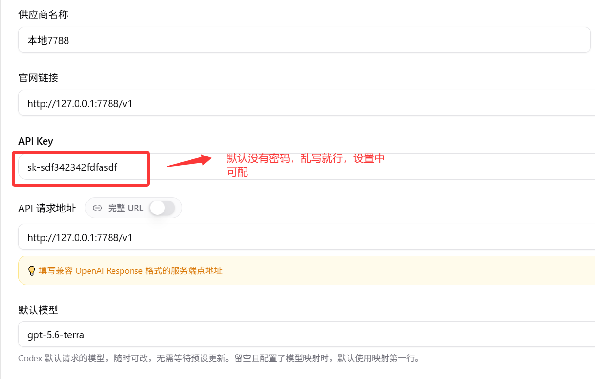
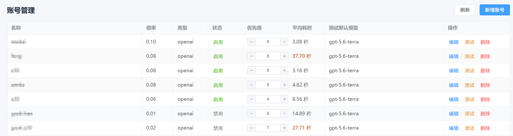
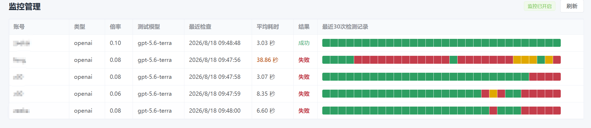
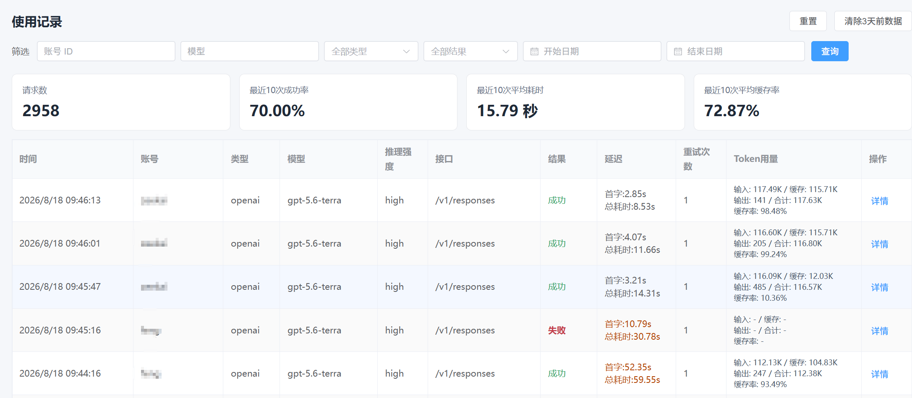
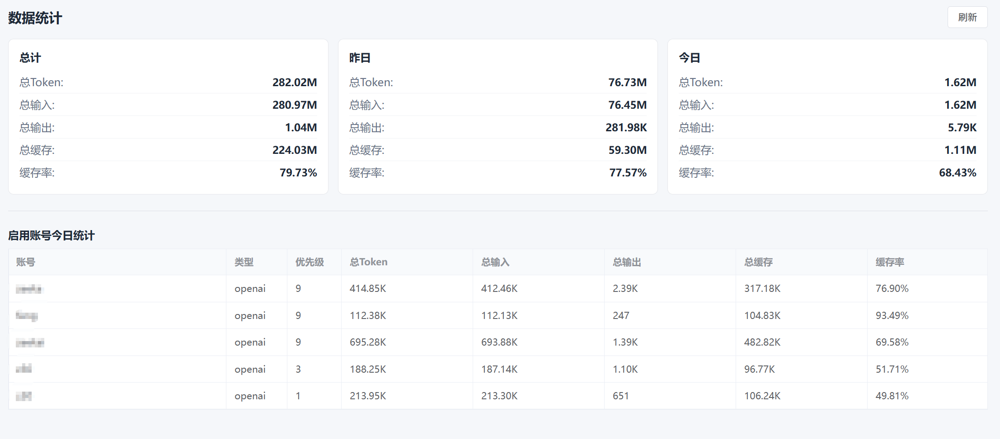

# AIMux

AIMux 是一个本地运行的 OpenAI/Anthropic 中转聚合网关。它把多个官方账号或中转站账号统一放入本地账号池，根据协议、模型、状态、优先级和倍率自动调度，并在失败时重试其他可用账号。

项目当前正式使用 Rust + Tauri 2 + Vue 3。桌面端、HTTP 网关和管理页面都由 Rust/Tauri 项目提供。

## 新手教程

第一次使用建议先阅读：[新手第一次使用教程](docs/新手第一次使用教程.md)

#### 建议直接让 AI 启动或打包

```text
请判断当前电脑是 macOS 还是 Windows，先读取项目规范和相关 skills，再使用 scripts 目录下对应脚本启动或打包 AIMux；如果脚本不适用，请使用当前环境兼容的 Rust/Node 命令。默认使用增量构建，完成后告诉我结果和产物路径，不要自动 commit 或 push。
```

### CC 配置示例



## 界面截图

### 账号管理



### 监控管理



### 使用记录



### 数据统计



## 为什么会有这个项目

市面上的中转站数量很多，但稳定性和倍率经常变化。使用单个中转站时，遇到限流、超时或故障，通常需要在 CC Switch 等工具中手动切换配置并重启客户端，工作流会被打断。

AIMux 的核心是多账号路由：把多个上游 Key（官方直连或中转站）统一录入本地账号池，客户端只配置一次 `http://127.0.0.1:7789/v1`，后续请求由 AIMux 根据最新状态和优先级选择账号。某个账号限流或报错时自动降级并重试下一个，无需手动切换。

设计原则：

- **协议原样转发**：OpenAI 请求走 OpenAI 账号，Anthropic 请求走 Anthropic 账号，不做协议转换或提示词改写。
- **本地运行**：数据库、配置和上游密钥保存在当前用户的数据目录，不上传到第三方服务。
- **故障自动降级**：失败尝试会记录失败原因并降低账号优先级；成功后按监控和调度规则恢复优先级。
- **Rust 原生实现**：网关使用 Axum/Tokio/Reqwest，数据库使用 SQLx + SQLite，桌面窗口使用 Tauri 2，管理页面使用 Vue 3。

## 技术栈

- 桌面端：Tauri 2
- 前端：Vue 3、Vite、Element Plus、Element Plus Icons、Pinia、少量自定义 SCSS/CSS
- 后端：Rust、Axum、Tokio、Reqwest、Tracing
- 数据库：SQLite、SQLx migrations
- API：OpenAI 和 Anthropic 兼容接口

## 启动

端口和启动方式集中说明在：[开发启动与端口说明](docs/开发启动与端口说明.md)。

| 模式 | 后端 | 前端 | 说明 |
| --- | ---: | ---: | --- |
| 稳定网关 | `7789` | `1420` | 给 Codex、Claude Code 或其他客户端使用 |
| 开发网关 | `7790` | `1421` | 后端调试和页面联调，不中断稳定网关 |

### Windows 脚本

在项目根目录双击对应脚本：

| 脚本 | 用途 |
| --- | --- |
| `scripts/windows/stable_start_rust_7789.bat` | 启动已编译的稳定网关 `7789` |
| `scripts/windows/stable_build_start_rust_7789.bat` | 编译最新 Rust 网关后启动 `7789` |
| `scripts/windows/dev_start_rust.bat` | 启动开发网关 `7790` |
| `scripts/windows/stable_start_frontend.bat` | 启动稳定前端 `1420`，连接 `7789` |
| `scripts/windows/dev_start_frontend.bat` | 启动开发前端 `1421`，连接 `7790` |
| `scripts/windows/dev_start_desktop.bat` | 启动 Tauri 桌面开发端，使用 `1421`/`7790` |
| `scripts/windows/stable_build_windows.bat` | 构建 Windows Tauri 安装包 |

日常前端开发只需要：

```powershell
npm install
npm run dev
```

后端开发网关：

```powershell
npm run dev:gateway
```

桌面端开发：

```powershell
npm run dev:desktop
```

正式 Tauri 安装版的前端已经嵌入应用，不会监听 Vite 的 `1420`/`1421` 端口；正式网关使用 `7789`。端口统一配置在 `config/runtime-ports.json`，启动脚本和 Vite/Tauri 配置都会读取它。

## 功能

### 账号管理

账号管理支持新增、编辑、删除、启用/禁用、优先级调整、倍率设置、支持模型、测试默认模型和模型映射。API 密钥按当前本机版本约定保存于本地数据库，不会上传。

模型映射可以将客户端模型名替换成特定账号上游接受的模型名，例如 `gpt-5.5 -> grok4.6`。调度先按客户端模型选择账号，再按被选账号的映射替换上游请求；账号测试和后台监控同样遵循这个规则。

### 模型维护

模型目录按 OpenAI/Anthropic 类型维护。账号的支持模型、测试默认模型和模型映射会从对应类型的模型目录中选择。

### 使用记录

使用记录保存每一次请求和每一次失败尝试，包括开始/结束时间、首字耗时、总耗时、账号、协议、模型、推理强度、接口、流式状态、状态码、错误信息、输入/输出/缓存/总 Token、缓存率和重试次数。列表支持查询、分页、详情查看和清除 3 天以前的数据。

流式请求在收到首个请求时创建记录，在流结束或读取异常时更新最终状态；因此中途断流也会留下可排查的记录。

### 监控

后台监控按设置的间隔测试所有启用账号，并保存最近检测状态和耗时。页面切换不会停止后台任务。监控结果会影响账号状态和优先级，失败记录为红色，超过耗时阈值的记录为黄色。

### 数据统计

数据统计展示总计、今日和昨日的总 Token、输入、输出、缓存及缓存率，并展示启用账号的今日使用情况。

### 设置

设置包括端口、总尝试次数、首字超时、请求超时、监控开关和监控间隔、上游代理、本地令牌等。总尝试次数表示一次客户端请求最多向上游发送多少次请求，与账号数量无关；设置保存后下一次请求立即生效。

## 兼容接口

OpenAI 兼容接口包括 `/v1/models`、`/v1/chat/completions`、`/v1/completions`、`/v1/responses`、`/v1/embeddings`、`/v1/moderations`、`/v1/images/generations`、`/v1/audio/speech`、`/v1/rerank`，以及 Responses 的 `cancel`、`compact` 操作。

Anthropic 兼容接口包括 `/v1/messages`、`/v1/messages/count_tokens`、`/v1/messages/batches`、旧版 `/v1/complete`，模型目录为 `/v1/anthropic/models`。

兼容接口只转发协议允许的请求体和请求头，不执行 OpenAI 与 Anthropic 之间的协议转换，不修改提示词或消息内容。上游认证头由本地账号配置注入。流式响应按 SSE 原样传回，并在结束时收集 usage 数据。

## 数据目录和数据库

Rust 版本始终使用当前用户数据目录中的 `aimux.db`，稳定网关、开发网关和桌面端共用同一套数据库：

- Windows：`%APPDATA%\\quietforge\\AIMux\\data`
- macOS：`~/Library/Application Support/quietforge/AIMux/data`

日志位于数据目录的 `log` 子目录，按天记录应用、请求和错误日志。数据库业务表和已有数据保持兼容；Rust 首个版本使用 `src-tauri/migrations/0001_baseline.sql` 作为 SQLx 基线，后续数据库结构变化只新增 SQL migration，不修改已发布的基线文件。

## 测试与打包

前端检查和构建：

```powershell
npm run format:check
npm run build
```

Rust 检查和测试：

```powershell
cd src-tauri
cargo fmt -- --check
cargo check
cargo test --lib
```

Windows 打包：双击 `scripts/windows/stable_build_windows.bat`。脚本使用 Tauri 增量构建，产物位于 `release/AIMux-Windows-<架构>.exe`。需要清理 Rust 构建缓存时，再按脚本说明执行全量清理。

macOS 打包可使用 Tauri CLI：

```bash
npm install
npm run tauri build
```

macOS 首次打开从 GitHub 下载的未签名应用时，如果系统提示“应用已损坏”，确认安装包来源可信后，在终端移除隔离标记：

```bash
xattr -cr /Applications/AIMux.app
```

如果应用仍在下载目录，将路径替换为 `~/Downloads/AIMux.app`。

GitHub Actions 在推送 `v*` tag 或手动运行 workflow 时构建 Windows x64/arm64 和 macOS x64/arm64 产物，并在 tag 构建成功后自动创建 GitHub Release。当前产物未配置 Apple 公证或 Windows 代码签名。

## 项目文档

- [功能清单](docs/功能清单.md)
- [架构和技术细节说明](docs/架构和技术细节说明.md)
- [开发启动与端口说明](docs/开发启动与端口说明.md)
- [技术栈说明](docs/重构技术栈分析.md)
- [账号管理功能](docs/账号管理功能.md)
- [模型维护功能](docs/模型维护功能.md)
- [使用记录功能](docs/使用记录功能.md)
- [监控功能](docs/监控功能.md)
- [设置功能](docs/设置功能.md)
- [调度逻辑说明](docs/调度逻辑说明.md)
- [QA](docs/QA.md)

## License

详见 [LICENSE](LICENSE)。
